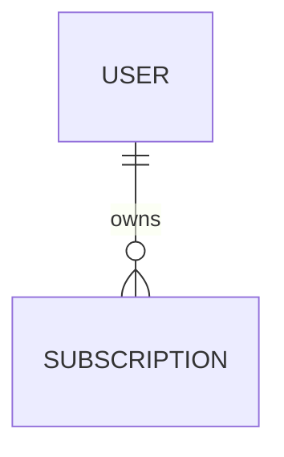

# Spec template

The spec is the rich container produced at Crystallize. It absorbs
PRD-leaning, ERD-leaning, decision-log, and interface-sketch content as
named sections. Functional and non-functional requirements are always
present. All other conditional sections are populated only when the
dialogue produced relevant signal — never as empty placeholders.

A "small spec" (the engineering one-pager) is just a spec where most
conditional sections are dropped and FR / NFR are minimal. Same template,
less content.

## Frontmatter

```yaml
---
kind: spec
slug: <kebab-case>
title: <Human Readable>
created: <YYYY-MM-DD>
status: draft
related: [<sibling issue paths>]
confidence: <0-100>
sketches_locked: true|false
---
```

## Section presence rules

| Section | Always | Conditional trigger |
| --- | --- | --- |
| Executive Summary | yes | — |
| Problem Statement | yes | — |
| Reproduction | no | Diagnose mode populated a Phase 0 loop |
| Users & Pain | no | dialogue surfaced user/business signal |
| Goals | yes | — |
| Non-Goals | yes | — |
| User Stories | yes | for pure-refactor specs, a single maintainer story is fine |
| Functional Requirements | yes | — |
| Non-Functional Requirements | yes | — |
| Context (Existing Landscape, Constraints, Dependencies) | yes | — |
| Entity Model | no | dialogue surfaced schema or relationships |
| Approach (Options A/B/Do-Nothing) | yes | — |
| Interface Sketches | no | Sketch mode produced any signatures |
| Decisions | no | dialogue resolved hard-to-reverse choices |
| Risks & Mitigations | yes | — |
| Quality Gates | yes | — |
| Red/Green Paths | no | dialogue produced end-to-end verification scenarios |
| Open Questions | yes | — |

Empty conditional sections are dropped at write time. Do not leave headings
followed by `_(none)_` placeholders.

## Body template

```markdown
# <Feature>

## Executive Summary
<3-5 sentences: what we're building, why, and the key decision>.

## Problem Statement
<JTBD framing — the job this feature does for the user. Drawn from Beat 0
of Explore mode>.

## Reproduction
> Bug-shaped specs only. The Phase 0 feedback loop from Diagnose mode lands
> here verbatim. Human-supplied; the agent does not infer steps or signals.

**Loop technique:** <failing-test | curl-script | cli-invocation | headless-browser | replay | throwaway-harness | property-fuzz | bisection | differential | HITL-bash>

**Loop command:** <exact, deterministic command or script — runnable by `/cook` to verify the fix>

**Failure signal:** <specific symptom: error message, wrong output, slow timing — what the loop reports when the bug is present>

**Reproduction rate:** <100% | high (e.g. 50/100 runs) | flaky (low single digits — must be raised before debugging)>

### Steps
1. <step>
2. <step>
3. <step>

### Expected vs Actual
- **Expected:** <what should happen>.
- **Actual:** <what happens instead>.

## Users & Pain
- Who feels this today
- Why now
- What this unlocks

## Goals
- [ ] <Goal>

## Non-Goals
<What we're explicitly NOT doing>.

## User Stories
> Format: `As a <user>, I want <feature> so that <benefit>.` Each story
> carries machine-checkable acceptance criteria so `/cook` can plan
> against them without re-asking. Pure-refactor specs can ship with a
> single maintainer story; the section is never empty.

### US-001: <Title>
**Story:** As a <user>, I want <feature> so that <benefit>.

**Acceptance criteria:**
- [ ] <Specific, verifiable criterion — not "works correctly".>
- [ ] <Another criterion>.

### US-002: <Title>
**Story:** As a <user>, I want <feature> so that <benefit>.

**Acceptance criteria:**
- [ ] <...>.

## Functional Requirements
- FR-1: The system must <verb> when <condition>.
- FR-2: <...>

## Non-Functional Requirements
- NFR-1: <latency, availability, security, observability constraint>.
- NFR-2: <...>

## Context

### Existing Landscape
<What already exists, with file refs from cheez-search>.

### Constraints
<Technical, business, timeline>.

### Dependencies
<What we depend on; what depends on us>.

## Entity Model



### Entities
- **USER** — <description>
- **SUBSCRIPTION** — <description>

## Approach

### Option A: <Name> (Recommended)
<Description, trade-offs, why recommended>.
> [confidence: 80] Evidence: <validate cycle ref, cheez-search refs, briesearch ref>

### Option B: <Name>
<Description, why not chosen, what would flip the decision>.
> [confidence: 65] Evidence: <...>

### Option C: Do Nothing
<What happens if we don't build this; conditions under which Do Nothing wins>.

## Interface Sketches
> Pseudocode signatures locked during /mold. Names + types + contracts; not
> final code. /cook translates to the target idioms. Each sketch declares
> its Sliced Bread slice (`domains/<name>`, `adapters/<name>`, `app`,
> or `domains/common`) so /cook places code on the correct side of the
> crust.

### `<module path>`
**Slice:** `domains/<name>` | `adapters/<name>` | `app` | `domains/common`.
**Responsibilities:** <one>, <two>, <three>.
**Seams:** <queue>, <cache>, <event_bus>.

```pseudo
def <name>(
    <arg>: <Type>,
    ...
) -> <Return>
```

**Error shape:** `<ExceptionA>` — <when>; `<ExceptionB>` — <when>.

## Decisions
> Append-only. Each decision: Context, Decision, Consequences.

### D-1: <Decision title>
**Context:** <one paragraph>.
**Decision:** <one paragraph>.
**Consequences:** <one paragraph>.
> [confidence: 85] <Validate cycle ref>; <Grill turn ref>.

## Risks & Mitigations
- **Risk:** <what could fail> → **Mitigation:** <how we prevent or recover>.

## Quality Gates
- `<command>` — <what it checks>.

## Red/Green Paths
> End-to-end verification scenarios. The agent picks one Green path per
> US-NNN and at least one Red path that exercises the unhappy seam.

- **Green:** <user does X> → <system responds with Y> → <state becomes Z>.
- **Red:** <user does X without <precondition>> → <system returns <error>> → <no state change>.

## Open Questions
- [?] <agent uncertainty>
- [TBD] <user-deferred decision>
- [BLOCKED] <external dependency>
```

## Confidence formula

Document-level `confidence` in the frontmatter is mechanical:

```
# rounds = count of distinct mode entries in the state file's Mode history
#          (each Explore/Ground/Shape/Sketch/Grill/Diagnose segment counts as 1;
#           inline validate-cycle markers are excluded from the count)
base       = min(rounds * 15, 100)
penalties  = 20 * count([BLOCKED]) + 10 * count([TBD]) + 5 * count([?])
bonuses    = 5 * count(SUPPORTED validate cycles)
malus      = 10 * count(CONTRADICTED validate cycles)
confidence = clamp(base - penalties + bonuses - malus, 0, 100)
```

Inline confidence at decision points uses the same scale and cites the
specific evidence (validate cycle id, Grill turn, sibling file ref).

## Migration from state file

At Crystallize:

- `Decisions (resolved)` block in state → `Decisions` section in spec
  (with Context / Decision / Consequences expanded by the agent).
- `Sketches (locked interfaces)` block → `Interface Sketches` section.
- `Validate cycles` block → cited inline in Approach, Decisions, and
  Interface Sketches sections via `> [confidence: ...] Evidence: ...`.
- `Open questions` block → `Open Questions` section verbatim.
- `Reproduction loop` block (Diagnose only) → `Reproduction` section verbatim;
  agent fills in Steps and Expected/Actual from the loop's recorded behaviour.
- `Grill turns` block → not migrated to spec; serves the coherence checklist
  (turn-completion proof) and stays in scratch state.
- `Quality gates` block → `Quality Gates` section verbatim.

## Collisions

| Existing | Default | Override |
| --- | --- | --- |
| Same slug, status `draft` | overwrite | `<slug>-v2` rev |
| Same slug, status `approved` | rev to `<slug>-v2` | never silently overwrite |
| Existing spec, new issues for same slug | append issues to that slug's series | — |

`/mold` writes new specs as `status: draft`. The `draft` → `approved`
transition is **external** — a human reviewer flips the field after sign-off.
`/mold` never auto-promotes. The `approved` collision branch fires when a
later `/mold` run encounters a previously-approved spec, and protects it from
silent overwrite.

## Atomic write

Stage to `.cheese/.mold-staging-<run_id>/` (a sibling of the destination,
guaranteed same filesystem) and `mv` into place. This ensures `mv` is an
atomic rename rather than a cross-filesystem copy+delete. On failure, the
staging directory is removed and no partial files exist in `.cheese/`.
